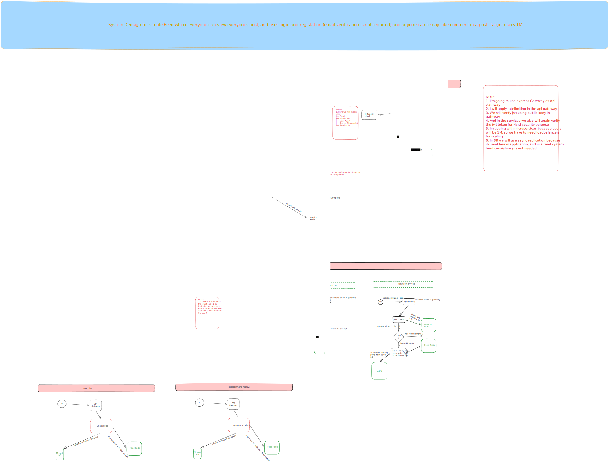

## It's a Simple Feed System ##

# Requirements:

1. Users can register without email verification.
2. After users log in, they can make a post with an image.
3. Anyone can view anyone's post.
4. Users can comment and can also reply on a comment.
5. Users can like or dislike a post, comment, and reply.
6. Can handle 1M users (Read:Write ratio not mentioned).


# Main components:

I have 3 services:
1. Authentication-service
2. Like-comment-service
3. Post-service
4. Setup-service

# 1. Authentication-service:
Here we handle all kinds of authentication. I used the RS256 algorithm because it uses a Private Key and a Public Key.

# 2. Post-service:
This service is responsible for posting images and posting text. We can also separate the image uploader, but for now it's kept within the post service.

# 3. Like-comment-service:
This service is responsible for users' likes on posts, likes on comments and replies, and the comments and replies themselves.

# 4. Setup Service
In this folder i added all kind of setup scripts like: database setup, master slave setup, docker files:
  Setup: 
    ``` cd service_name
        npm install
    ```
    Start databases:
    ```
        cd setup
        npm install        # one-time
        npm run up         # docker compose up -d
        npm run migrate    # apply pending migrations to master (replica auto-syncs)
        npm run down       # stop the stack
        npm run logs       # tail logs
    ```
    Run services:
    ```
        cd service_name
        docker compose up -d
        or
        npm run start
    ```


# Databases:
For now I'm using a PostgreSQL database and Redis for cache. In PostgreSQL I have one master and one slave, and I basically used async replication. I used it because I'm developing a feed system, so strong consistency is not needed here.

## System design:



# Schema design:

https://dbdiagram.io/d/6a52321036d348d120bde012